# Guide for LEL

This is a guidline for lel. And for demonstration this should also be visable in lel:

_Tipp_:
Use "code-blocks" to specify the meta information, for better visualization/rendering.

```
@name guideline
@entity document
@tags docu, features, display
```

**AGENDA**

- [Logger/Milestones](#logger/milestone)
- [Editors](#editors)
  - [Graph](#graph)
  - [Recorder](#recording)
  - [Chronic](#chronic)
- [OpsServer](#opsserver)
- [API](#api)

---

## Logger/Milestone

For documentation reason it might be good to track, which commands were execute against a server or how a specific payload was generated or tool was used. In order to help this (and the blue team later in the report), it might be good to track such commands. This very simple logger can be used as a minimum regarding CLI-logging.

THIS IS NOT FOR AUDITS, since the user can easily manipulate the files inside the directory.

### Requirements

- jq
- uuidgen
- curl
- zenity

### Configure

Can be found here: [\_simple-logger/logger.src.sh](_simple-logger/logger.src.sh) and currently be used in a bash/fish/zsh/sh shell.

Two things must be set before _sourcing_:

- `MISATO_LOGDIR=$HOME/.lel`
- `MISATO_LOGGER=start`

Afterwards the logger can be enabled through:

```bash
source logger.src.sh
```

This loggers logs every command (currently not output) in a json structure to the MISATO_LOGDIR.

Furthermore if all environments are set: -`MISATO_OPERATORAPI="https://127.0.0.1:8888"` -`MISATO_OPERATORKEY="CURRENTYLY-NOT-IMPLEMENTED"` -`MISATO_FILTER="${MISATO_FILTER:-.}"`

Then the commands, which matches the regular expression in `MISATO_FILTER` will be sent to the LEL server (specified in `MISATO_OPERATORAPI`).

This might be helpfull to document stuff, if a proxy is used:

```bash
proxychains4 curl google.de
```

### Start/Stop Change the logger

```bash
toggle_misato local
toggle_misato remote

misato_milestone
```

Simple commandline logger with two modi:

- Logging to _Local_
- Logging to _Local_ and _Remote_

It loggs every command in a json structure.

```
{"time":"1572268522","termuuid":"9db7485d-a58a-4c29-b6d2-3e1b92832f82","pid":"31657","user":"sil","pwd":"/home/sil/lel-demo","command":"milestone_log"}
```

## Editor

Once started

```bash
./LEL -docu ~/new-project
```

### Menu Bar

The menu bar is separated between a few sections. The cog handle some settings, such as `recording` and `externalEditor`. The next item handles some specific Views, which can be used as a project overview.

The rest of the items, including graph, navigation, tags, search and commandlogs can be displayed anytime and act as an information overlay.

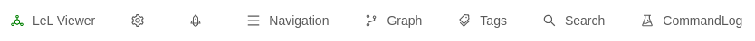

### Navigation

LEL provides two navigations: the Sticky navigation, which can be toggled on the left and stays open and the adhoc navigation in the menu bar. Both display all `.md` files in the `notes` directory.

The representation is a Tree. If the `@name` metainformation is found inside a document it is rendered asa tag and can help, when referencing the note.

Similar to almost every Overlay a searchbar is present, which can be used to find a file. Name tags _cannot_ be used for the search.

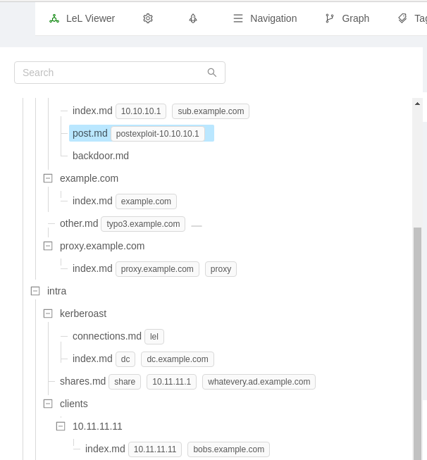

### Editor/Viewer

The editor is splitted into three parts. On top are all relevant metainformation, as well as options for saving and opening the document in the external editor.

The other parts is the editor and the markdown preview.

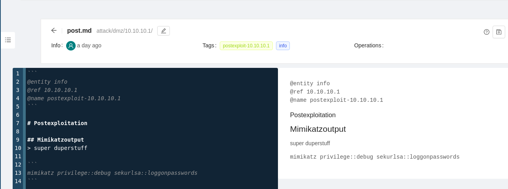

### Search

The content search can be used to search within all `*.md` files inside the `notes` direcotry. the highlighted path can be used to display the document, the pencil allows the file to be opened in the external editor

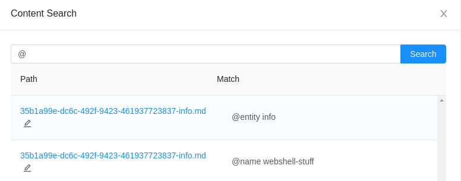

### Graph

One of the major aspect for LEL is the graph representation. When a note provides certain metainformation such as `@name` and `@entity` it is displayed in the graph. The representation can be changed either by changing the entity value to one of the standard such as:

```bash
server
node
database
ad
win
user
globe
site
client
cserver
```

or through the `@icon` customization. Currently edges are not customizable.

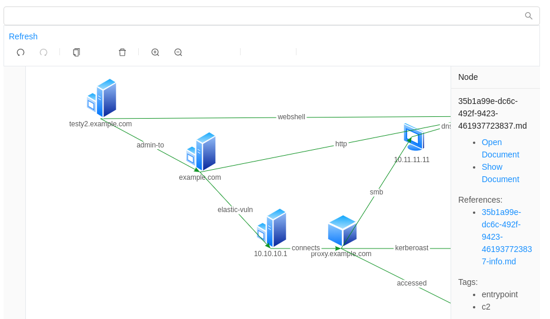

It is possible to filter the graph based on _one_ specific tag. if a node has the searched tag (can be seen in the detail menu), then the node is displays.

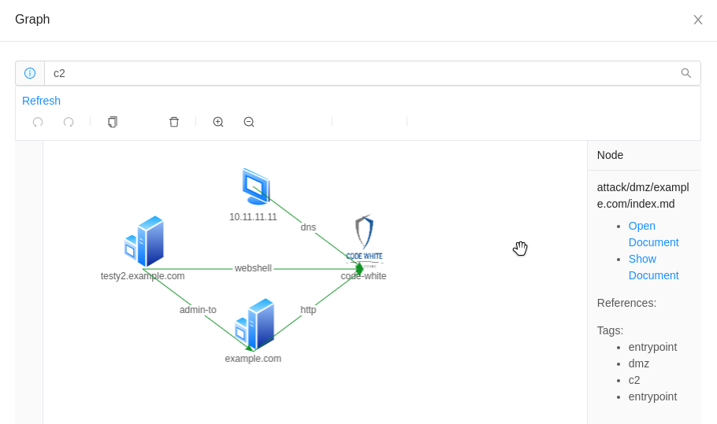

### New documents

In order to create new files two things can be specified. At first if the new file should open in the `external` editor or the LEL one. This can be configured in the settings toggle Button (see the menu in the next section). Additionally either a snippet or tempory file can be created through the `snippet` button or the `new path`, which let you specify the new file.

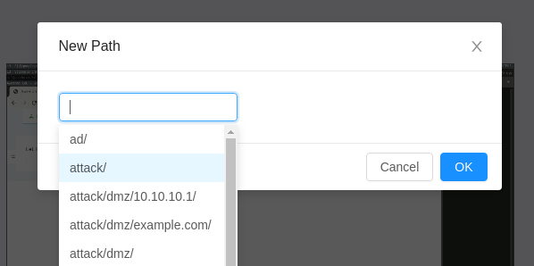

### Recording

> FEATURE

One documentation feature which fits perfectly with the Chronic ones is the recording. Before recording, which can be done with the `Record` button, a few options can be set.

The first slider defines the recording interval, the time in minutes for each video. This helps to record small chunks of the assessment and later delete unnessary parts also if the recording fails (e.g. browser/ virtual machine crashes) only a small portion is missing.

The framerate can be choosen by the other slider. This can also be size/ performance option.

The frameratio and width/height are choosen by the start of the recording based on the display height, so normally this should be enough. A small message is displayed when the recording starts.


The size changes based on the settings:

**Example**:

```bash

1600x900
~1min ~ 15mb
1h ~ 900mb
10h ~ 10GB
```

### Image

> FEATURE

Images are an important part of each documentation. Therefore you can view all images in lel. This includes all pictures, which are inside the `images` folder. Below you'll find a short Copy & paste section to copy the markdown syntax to quickly add it to the notes.

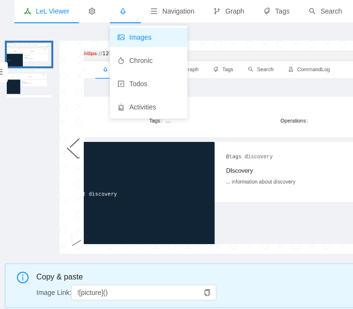

If enabled the `upload Image` allows _pasting_ previously copied images.
Copy the image of your choice then click inside the section and simply paste (via ctrl+v) and a popup should happen. There you are prompted to chose a name. Afterwards the image is uploaded to the folder and can be used inside the document.

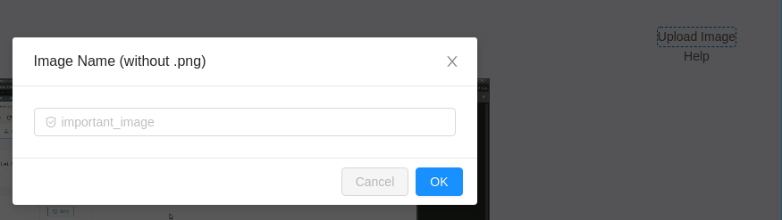

### Chronic

> FEATURE

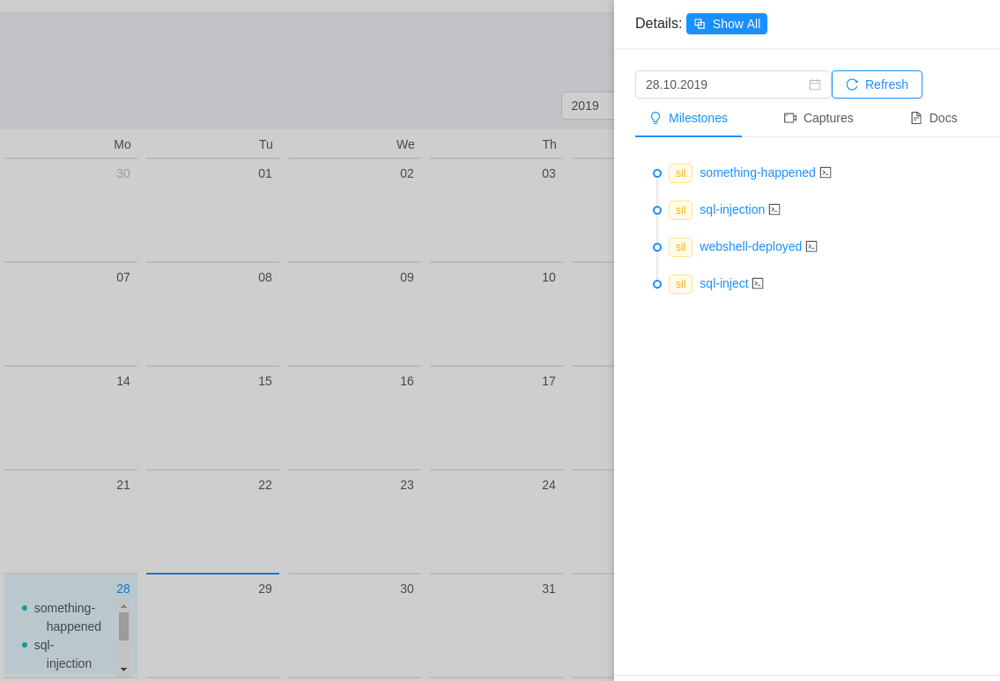

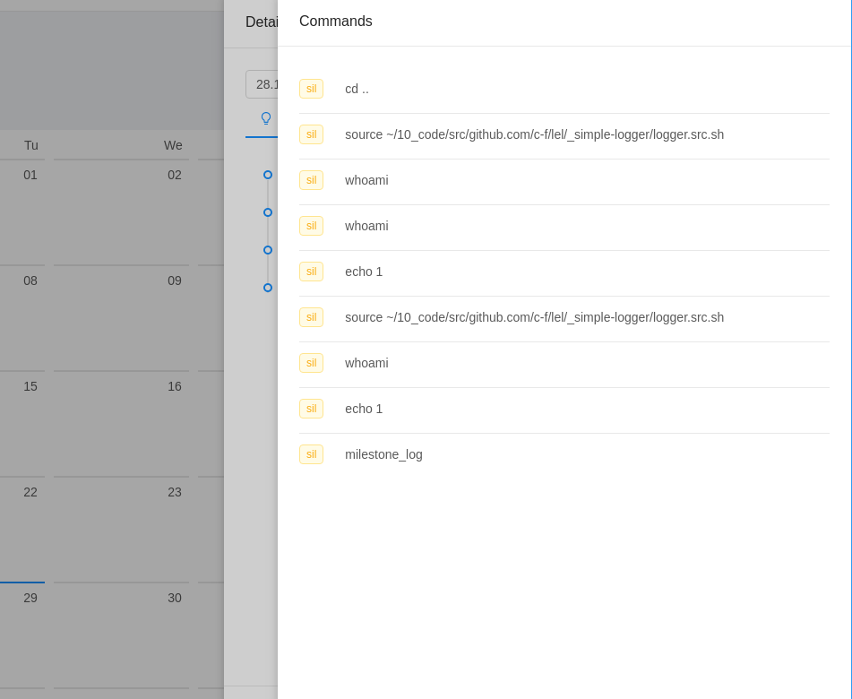
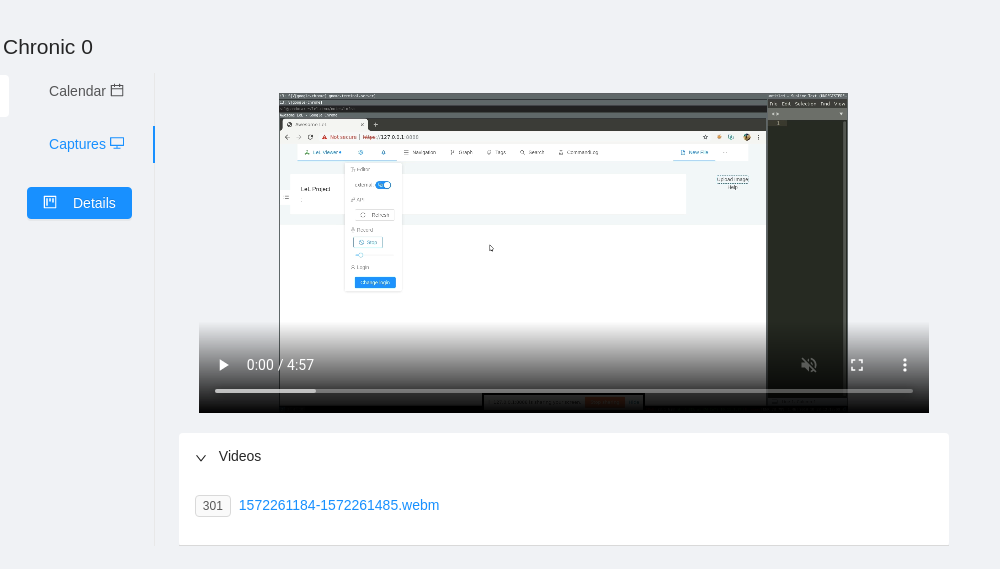

### FEAT: TODO.txt

> DISABLED / currently developing

### FEAT: tags

> DISABLED / currently developing

### FEAT: activities

> DISABLED / currently developing

### OpsServer

> DISABLED / currently developing

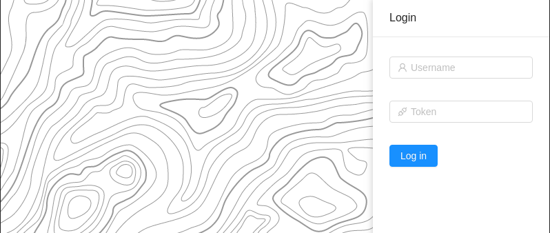

### API

For detailed documentation can be found [here](./api.md)
